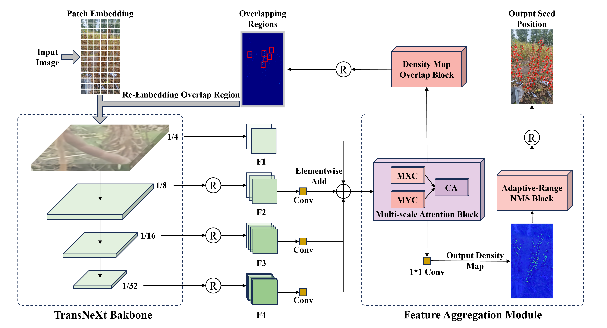
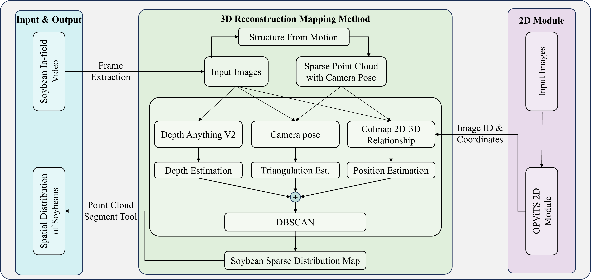

# OPViTS: A Vision Transformer and SfM-Based Framework for In-Field Soybean Seed Counting and 3D Localization

**Wenchuan Ma1,*, Ruinian Li1, Mengbo Yang1, Xuanbin Xu1**

1 School of Electrical and Information Engineering, Northeast Agricultural University, Harbin 150030, China
* Corresponding Author: `mawenchuan@neau.edu.cn`

**[Paper PDF (Avaliable Soon)]()** | **[Code (Avaliable Soon)]()** | **[Dataset (Avaliable Soon)]()**

---

We propose OPViTS, an end-to-end framework that integrates advanced 2D vision techniques with efficient 3D reconstruction for robust soybean seed counting and localization.

## Main Contributions

1.  **Novel OPViTS Model:** Proposes an Overlap Patching Vision Transformer with MSCAA, DOB, and ARNMS for significantly enhanced 2D soybean seed detection and counting accuracy in complex field environments.
2.  **Efficient 2D-3D Fusion Module:** Designs a lightweight strategy integrating OPViTS 2D results with SfM (Mast3R) and depth estimation (Depth Anything V2) for accurate 3D seed localization, reducing computational overhead compared to full 3D reconstruction.
3.  **Comprehensive Multi-Modal Dataset:** Constructs a new field dataset including handheld video, SfM results, and manual annotations to support robust model training and evaluation for this challenging task.
4.  **Superior Performance:** Demonstrates state-of-the-art results on benchmark datasets for 2D counting and localization, and validates the effectiveness of the 3D mapping approach.

## Our Solution: The OPViTS Framework

### 1. 2D Soybean Seed Counting & Localization (OPViTS Model)

The core of our 2D analysis is the OPViTS model, which leverages a Vision Transformer backbone and introduces several key innovations:
*   **Overlap Patching Vision Transformer:** Enhances feature extraction for small and dense targets.
*   **Multi-scale Cross-Axis Attention (MSCAA):** Captures fine-grained details and context across different scales.
*   **Density Map Overlap Block (DOB):** Iteratively refines high-density regions by re-processing corresponding image patches for more detailed features, significantly improving performance in occluded scenarios.
*   **Adaptive-Range Non-Maximum Suppression (ARNMS):** Dynamically adjusts the suppression radius based on local density, balancing missed detections and false positives.

*Overview of the OPViTS network architecture.*

### 2. 3D Seed Localization & Mapping

To achieve 3D localization, OPViTS integrates 2D detection results with a lightweight 3D mapping strategy:
*   **Structure from Motion (SfM):** Utilizes Mast3R for efficient sparse point cloud generation and camera pose estimation from video sequences.
*   **Depth Estimation:** Employs Depth Anything V2 for coarse depth estimation of entire images, assisting in 2D-3D projection.
*   **2D-3D Fusion:** Projects 2D seed coordinates (from OPViTS) onto the 3D point cloud. A robust fusion strategy combines direct SfM matches, depth-guided projections, and optical center projections.
*   **DBSCAN Clustering:** Merges multiple 3D detections of the same seed from different viewpoints, eliminating redundant counts.

*Schematic of the 2D-3D reconstruction and mapping process.*

---
## Citation

If you find our work useful, please consider citing:
